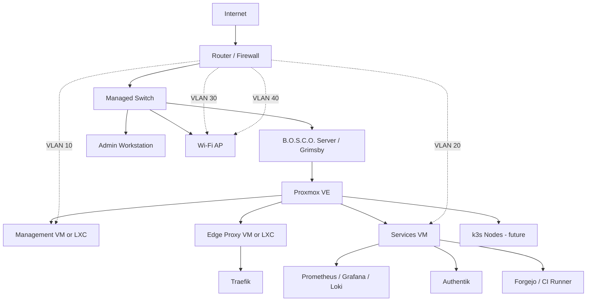

# Physical Server Inventory

Last updated: 2026-07-15

## Server Identity

| Field | Value |
| --- | --- |
| Hostname | `Grimsby` |
| Project role | B.O.S.C.O. core homelab host |
| Primary purpose | Virtualization, containers, monitoring, identity, and internal services |
| Operating system | To be documented after base OS install |
| Hypervisor | Planned: Proxmox VE |

## CPU

| Field | Value |
| --- | --- |
| Model | AMD Ryzen 5 3600 6-Core Processor |
| Architecture | x86_64 |
| Physical sockets | 1 |
| Cores | 6 |
| Threads | 12 |
| Virtualization support | AMD-V |

## Memory

| Field | Value |
| --- | --- |
| Installed RAM | 15 GiB visible to OS |
| Swap | 976 MiB |
| Current note | Consider upgrading to 32 GiB or 64 GiB before running multiple VMs plus k3s. |

## Storage

| Device | Size | Type | Filesystem | Mounts | Model | Notes |
| --- | ---: | --- | --- | --- | --- | --- |
| `nvme0n1` | 931.5G | NVMe SSD | mixed | `/`, `/home/oliver`, `/tmp` | Samsung SSD 980 1TB | Primary OS/data disk |
| `nvme0n1p1` | 512M | partition | vfat | `/boot/efi` | Samsung SSD 980 1TB | EFI boot |
| `nvme0n1p2` | 930.1G | partition | ext4 | `/`, `/home/oliver`, `/tmp` | Samsung SSD 980 1TB | Main Linux filesystem |
| `nvme0n1p3` | 977M | partition | swap | `[SWAP]` | Samsung SSD 980 1TB | Swap partition |
| `sda` | 192K | removable disk | vfat | `/media/oliver/SCARLETT` | Welcome Disk | Temporary/removable media |

## Network Interfaces

| Interface | MAC | Link state | Speed | Role |
| --- | --- | --- | --- | --- |
| `enp34s0` | `2c:f0:5d:df:ff:91` | up | 1000 Mb/s | Planned server uplink |
| `wlo1` | `4c:03:4f:04:6b:d6` | up | unknown | Wi-Fi, avoid for server workloads |
| `lo` | `00:00:00:00:00:00` | unknown | n/a | Loopback |

## Switch

| Field | Value |
| --- | --- |
| Switch model | TODO |
| Managed switch | TODO: yes/no |
| Server port | TODO |
| Uplink port | TODO |
| VLAN trunk ports | TODO |
| Access ports | TODO |

## VLAN Plan

| VLAN | Name | CIDR | Gateway | Purpose | Internet | Inter-VLAN access |
| ---: | --- | --- | --- | --- | --- | --- |
| 10 | Management | `10.10.10.0/24` | `10.10.10.1` | Proxmox, SSH, admin interfaces | restricted | Admin workstation only |
| 20 | Services | `10.10.20.0/24` | `10.10.20.1` | Internal apps and reverse proxy targets | allowed | From management and VPN |
| 30 | IoT | `10.10.30.0/24` | `10.10.30.1` | Untrusted smart devices | allowed | Deny to management/services by default |
| 40 | Guest | `10.10.40.0/24` | `10.10.40.1` | Guest Wi-Fi | allowed | Deny to internal networks |

## Network Diagram



## Inventory Refresh Commands

Run these after hardware or network changes:

```bash
lscpu
free -h
lsblk -o NAME,SIZE,TYPE,FSTYPE,MOUNTPOINTS,MODEL,SERIAL
for iface in /sys/class/net/*; do
  name=$(basename "$iface")
  printf '%s ' "$name"
  [ -f "$iface/address" ] && printf 'mac=%s ' "$(cat "$iface/address")"
  [ -f "$iface/operstate" ] && printf 'state=%s ' "$(cat "$iface/operstate")"
  [ -f "$iface/speed" ] && printf 'speed=%sMb ' "$(cat "$iface/speed" 2>/dev/null || true)"
  printf '\n'
done
```

